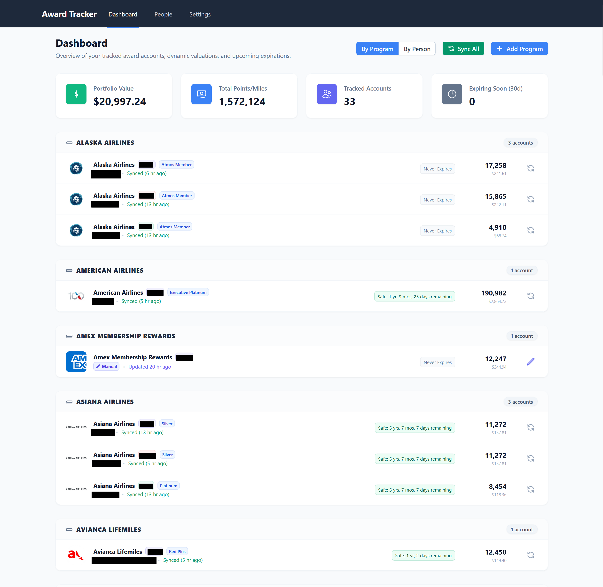
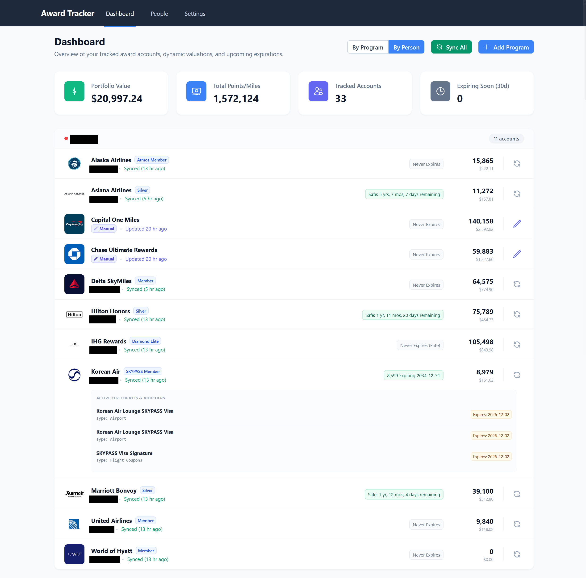
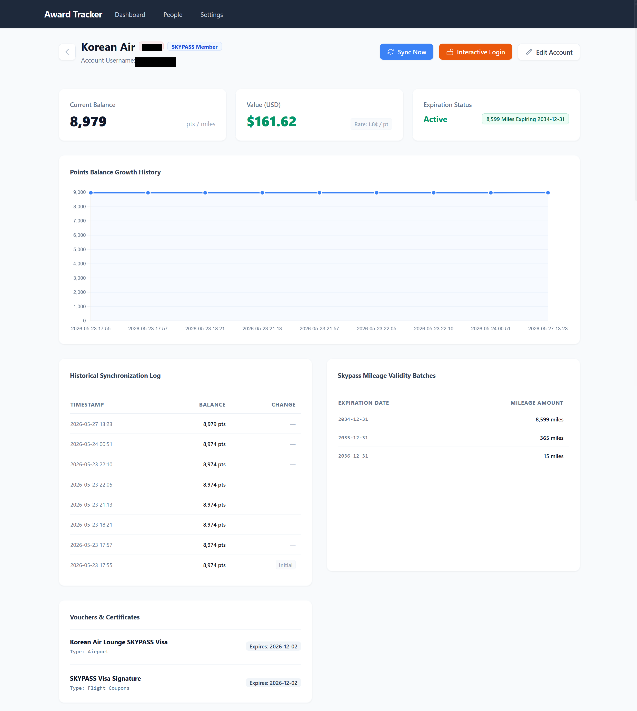

# 🤖 Award Tracker

**Award Tracker** is a secure, private, and 100% local reward portfolio management application. It runs locally as a background tray service on your computer, automatically or interactively synchronizing your point/mile balances, membership tiers, and reward certificate details from major airline, hotel, and credit card loyalty programs.

Unlike traditional cloud-based reward tracking portals that require you to upload your sensitive master credentials to their servers, Award Tracker operates under a **Zero-Knowledge Privacy model**. Your passwords are encrypted locally on your system and never traverse the cloud.

---

## 💡 The Problem Award Tracker Solves

Cloud-based rewards aggregators request your loyalty account login credentials and store them on centralized servers to scan balances. This design presents severe security concerns:
1. **Centralized Data Breach Risks**: If the aggregator is hacked, all your accounts, passwords, and personal details are compromised.
2. **Account Closures**: Automated cloud logins can flag accounts for suspicious IP activity, occasionally leading to account suspensions by major airlines.

### 🛡️ The Local, Free, and Secure Solution
Award Tracker runs entirely on your local machine:
* **AES-256 Local Cryptography**: All passwords and account identifiers are encrypted locally inside a SQLite database using Fernet symmetric encryption.
* **Master Password Unlock Key**: The encryption key is derived directly from a master password *only you* know. We store no cloud backups and have no password recovery option—meaning your data is completely secure and fully under your control.
* **Local Selenium Engines**: Automation tasks run directly on your own computer using standard local network addresses, mirroring normal browser navigation to avoid account lockouts.

---

## 🚀 Core Features

* **Vibrant Dashboard Portfolio**: Summarizes point balances, USD values, membership tiers, and upcoming expiration dates under beautiful card grids.
* **Unified Family Groupings**: Group and organize your reward portfolios cleanly by **Owner/Person** (complete with custom badge colors) or by **Program**.
* **Automated Background Syncing**: Quietly executes in the background at custom intervals (e.g. *Every Day*, *Every Week*), cleanly skipping offline or manually-managed portfolios.
* **Guided Interactive Sign-in (4-Step Overlay)**: When a loyalty program requires MFA or a captcha, Award Tracker opens a headed browser window, **pre-fills your ID and password automatically**, and injects a custom floating guide card (`awardtracker-guide-modal`) in the corner. The card walks you through four steps: (1) credentials are pre-filled — don't touch them, (2) click **Sign In / Submit / Continue** yourself, (3) complete any MFA code manually, and (4) once signed in, the tool auto-navigates to your mileage overview and closes the window — hands off!
* **Automatic Daily Database Backup**: Backs up your `awardtracker.db` file automatically at 3:00 AM daily (and on startup if yesterday's backup is missing). Retention window is user-configurable — **Never**, **3**, **7** (default), or **30** days — from the Settings page. Backup files are stored as `awardtracker_backup_YYYYMMDD.db` inside an `AwardTracker/backups/` folder in your OS application data directory.
* **Cross-Platform Native OS Notifications**: Dispatches native notifications locally through the Windows Action Center, macOS Notification Center, or Linux notify-send on app startup, sync start, sync success/failures, and points-expiry warnings.
* **Custom Manual Tracking**: Easily track points from credit cards (Chase, Amex, Citi, Capital One, Wells Fargo) or offline store programs (e.g. "Best Buy points", "Panera rewards"), complete with custom name overrides.

---

## 🎨 Visual Preview

### 1. Main Dashboard
Summarizes balances, equivalent USD valuations, and displays prominent rose warning badges if any account has points expiring within your warning threshold.



### 2. Guided Interactive Sign-In Overlay
When executing an Interactive Login, Award Tracker launches a visible browser window and injects a helpful assistant overlay directly in the viewport to guide you through MFA or captchas.

### 3. Tracking of points history
Provides a tracking chart that shows points history over the times.


---

## ✈️ Supported Loyalty Programs

### 💳 Credit Cards & Manual Programs
* American Express Membership Rewards
* Bilt Rewards
* Capital One Miles
* Chase Ultimate Rewards
* Citi ThankYou
* Wells Fargo Rewards
* Any other custom manually-tracked programs

### 🛩️ Airlines
* **Air Canada** (Aeroplan)
* **Alaska Airlines** (Mileage Plan)
* **All Nippon Airways** (ANA Mileage Club)
* **American Airlines** (AAdvantage)
* **Asiana Airlines** (Asiana Club)
* **Avianca** (LifeMiles)
* **British Airways** (Avios)
* **Delta Air Lines** (SkyMiles)
* **EVA Air** (Infinity Mileagelands)
* **Japan Airlines** (JAL Mileage Bank)
* **JetBlue** (TrueBlue)
* **Korean Air** (SKYPASS) — *includes automatic Mileage Validity Batch & Certificate recognition*
* **Southwest Airlines** (Rapid Rewards)
* **United Airlines** (MileagePlus) — *includes automatic United Club One-time pass certificate recognition*
* **Virgin Atlantic** (Flying Club)

> ⚠️ **Voucher & Certificate Support**: Automatic scraping of vouchers, coupons, and certificates is currently supported for **Korean Air SKYPASS** and **United Airlines MileagePlus** (United Club One-time passes). Other programs display an informational notice on their account detail page.

### 🏨 Hotels
* **Caesars Rewards**
* **Hilton Honors**
* **IHG One Rewards**
* **Marriott Bonvoy**
* **World of Hyatt**

### 🚗 Car Rentals
* **Hertz Gold+ Rewards**

---

## 🛠️ Developer Compilation Guide (macOS & Windows)

If you are a developer and want to clone and compile the application standalone binary:

### 1. Prerequisites
* **Python 3.14+** (Ensure Python is added to your system `PATH`)
* **Git**
* **Google Chrome** (Required for SeleniumBase web automation)

### 2. Local Installation Steps
1. Clone this repository:
   ```bash
   git clone https://github.com/your-username/awardtracker.git
   cd awardtracker
   ```
2. Create and activate a Python virtual environment:
   * **Windows**:
     ```powershell
     python -m venv venv
     .\venv\Scripts\Activate.ps1
     ```
   * **macOS/Linux**:
     ```bash
     python3 -m venv venv
     source venv/bin/activate
     ```
3. Install dependencies:
   ```bash
   pip install -r requirements.txt
   ```
4. Perform database migrations and set up the SQLite schema:
   * **Windows**:
     ```powershell
     venv\Scripts\python.exe -m flask db upgrade
     ```
   * **macOS/Linux**:
     ```bash
     python3 -m flask db upgrade
     ```
5. Run the dev server manually:
   * **Windows**:
     ```powershell
     venv\Scripts\python.exe main.py
     ```
     *(Or simply double-click the `run-win.bat` file in the root folder!)*
   * **macOS/Linux**:
     ```bash
     ./run-macos.sh
     ```

### 3. Standalone Compilation & Release Packaging
We have provided streamlined build and release tools that compile the Flask app, database migrations, static assets, and the tray daemon into standalone binaries and native setup installers:

#### Standalone Binary Compilation
* **Windows**:
  ```powershell
  powershell -ExecutionPolicy Bypass -File build-win.ps1
  ```
  Generates a standalone binary at `dist/awardtracker.exe` (~42 MB).
* **macOS**:
  ```bash
  ./build-macos.sh
  ```
  Generates a native app bundle at `dist/AwardTracker.app` (~54 MB) and standalone binary at `dist/awardtracker`.

#### Complete Release Packaging (Setup Installer & Portable Zip)
* **Windows (Setup Wizard)**:
  ```powershell
  powershell -ExecutionPolicy Bypass -File release-win.ps1
  ```
  Generates a Setup Wizard installer (`dist/awardtracker-setup.exe`) and portable zip (`dist/awardtracker-portable.zip`).
* **macOS (Disk Image DMG)**:
  By default, this compiles the application bundle targeting the **local architecture** of the build machine:
  ```bash
  ./release-macos.sh
  ```
  To package a **Universal 2** release (supporting both Intel and Apple Silicon Macs natively), run:
  ```bash
  ./release-macos.sh --universal
  ```
  > [!IMPORTANT]
  > To package a **Universal 2** release, you **must** use the official Python installer from [Python.org](https://www.python.org/downloads/mac-osx/). The default Python installed via Homebrew lacks Universal2 architecture support and will fail compatibility verification.
  > 
  > The script will automatically locate your official Python installation, set up a dedicated `venv-universal` environment, compile C extensions for both architectures, and merge libraries like `Pillow` into a unified binary.

  Both commands generate a native Drag-and-Drop Disk Image installer (`dist/awardtracker-macos-setup.dmg`) and portable zip (`dist/awardtracker-macos-portable.zip`).

### 4. Running the Tests
To verify all APIs, naming overrides, settings parameters, and plugin infrastructure are fully functional, execute our premium color-coded test runners:
* **Windows**:
  ```powershell
  powershell -ExecutionPolicy Bypass -File run_tests.ps1
  ```
* **macOS/Linux**:
  ```bash
  ./run_tests.sh
  ```

---

## 🧭 Beginner's Onboarding Guide

Welcome to Award Tracker! Follow these steps to get started:

### 1. The Taskbar Tray Icon
* When you launch the application, it starts silently in the background. Look for the **Award Tracker Tray Icon** (🤖) in the bottom-right corner of your taskbar (system tray).
* **Right-click the icon** to access controls:
  * **Open Dashboard**: Launches the main web interface in your default browser.
  * **Sync All Now**: Immediately triggers background synchronization.
  * **Exit**: Fully closes the background tray service.

### 2. Master Password Setup
* On your very first launch, the application will guide you through an onboarding slider and prompt you to set a **Master Password**. 
* Choose a strong password. This password will encrypt all your loyalty passwords locally. You will need to type this password to unlock the app when it restarts.

### 3. Adding Your First Account
1. Open the dashboard (via tray menu).
2. Click **Manage People Profiles** to add family profiles (e.g. "John", "Sarah") and choose distinct colors for them.
3. Click **Add Account**:
   * **Automated Sync**: Select a provider (e.g. *United Airlines*), enter your username, password, select the profile owner, and click **Save**.
   * **Manually-Tracked Programs**: Select *Manual Tracking* as the provider, enter your *Custom Program Name* (e.g. *Best Buy points*), and save.
4. Click the **Sync Now** button (🔄) on the card to run a background sync and pull your balances automatically!

### 4. Interactive Login (MFA / Captcha)
If automated sync fails due to MFA, click the **Interactive Login** button (🔒) on the account card or detail page. A Chrome window will open:
1. The tool **pre-fills your ID and password** automatically — do not modify them.
2. Click **Sign In**, **Submit**, or **Continue** yourself.
3. Complete any MFA code or captcha manually.
4. Once signed in, the tool navigates automatically and closes the window — do not interact at that point.

After a successful interactive login, click **Sync Now** to refresh your balance.

### 5. Database Backup
Award Tracker automatically backs up your database daily. To configure the retention window, go to **Settings → Data & Backup** and choose between **Never**, **3**, **7** (default), or **30** days. Backup files are stored in:
* **Windows**: `%APPDATA%/AwardTracker/backups/`
* **macOS**: `~/Library/Application Support/AwardTracker/backups/`

### 6. Debug Mode & Diagnostic Bug Reports

If you experience synchronization issues or sync tasks fail repeatedly due to structural updates on loyalty sites, you can activate **Debug Mode** to gather details for troubleshooting:
* **Enable Debug Mode**: Navigate to **Settings → Diagnostics & Debugging** and check **Enable Diagnostic Debug Mode**. 
* **Privacy Masking (Enabled by default)**: Toggling **Mask Sensitive Information** automatically intercepts and replaces your usernames, passwords, and points balances with `***` across all screenshots, rendered HTML source files, and text logs.
* **Granular Logs & Snapshots**: When Debug Mode is active, Award Tracker creates run-specific folders under `%APPDATA%/AwardTracker/logs/{YYYY-MM-DD}/{timestamp}-{account_id}-{provider}/` containing:
  - `run.log`: A granular step-by-step trace of SeleniumBase actions, including the current browser URL for each step.
  - Sequential screenshots (`.png`) and HTML source dumps (`.html`) of the browser window.
* **Exporting Bug Reports**: Scroll down to **Export Diagnostic Bug Report** in Settings. Select a time window (e.g. *Last attempted sync*, *Last 1 hour*, or *All time*) and export categories:
  - **Include general debug logs**: Packages `awardtracker_debug.log` and all run-specific `run.log` files.
  - **Include HTML source code & page screenshots**: Packages all page screenshots and markup dumps (only available if Debug Mode was enabled, unchecked by default to save bandwidth).
  - Click **Download Diagnostic Zip** to download a compressed report that you can upload directly to GitHub issues for easier developer debugging.
